#  第一章_Python语法基础

BY 吴铭英 20210921

211118更新

[TOC]

## 0. 前言

### 0.1 课程目标

通过本课程，希望你能达成以下⽬标：

* 能够⽤Pycharm创建新项⽬、运行和调试
* 能够自行深入学习Python

### 0.2 面向群体

* 八年级全体
* 703、704

### 0.3 下课前5分钟检查笔记

* 组长的笔记由我检查，组员的笔记由组长检查
* 课堂记录表现、任务完成情况

### 0.4 比赛

* NOC 
* 蓝桥杯
* 网络夏令营-程序设计

### 0.5 每日任务

* 第一周：熟悉pycharm平台-输出一句你喜欢的名言
  * 例如：Give me six hours to chop down a tree and I will spend **the first four sharpening the axe.** By  **Abraham Lincoln**
* 回顾上一周的代码
  * 复现上周学习的案例（例如：列表的练习、海伦公式求三角形面积、三个数比较大小等）

### 0.6 奖励

* 限量版北京大学手绘明信片
* 文具等

## 1. 概述

### 1.1 Python是什么

> Python 是一种**解释型**、面向对象、动态数据类型的高级程序设计语言。
>
> Python 由Guido van Rossum 于<font color=red>  1989 </font>年底发明，第一个公开发行版发行于 1991 年。
>
> ref:https://www.runoob.com/python/python-tutorial.html

如果对Python的历史感兴趣，可以阅读名为[《Python简史》](http://www.cnblogs.com/vamei/archive/2013/02/06/2892628.html)的网络文章。

* 解释型:**一边执行一边转换**，需要哪些源代码就转换哪些源代码，不会生成可执行程序，比如 [Python](http://c.biancheng.net/python/)、[JavaScript](http://c.biancheng.net/js/)、[PHP](http://c.biancheng.net/php/)、Shell、[MATLAB](http://c.biancheng.net/matlab/) 等，这种编程语言称为解释型语言，使用的转换工具称为解释器。
* 编译型：提前**将所有源代码一次性转换成二进制指令**，也就是生成一个可执行程序（Windows 下的 .exe），比如C语言、[C++](http://c.biancheng.net/cplus/)、Golang、Pascal（Delphi）、汇编等，这种编程语言称为编译型语言，使用的转换工具称为编译器。
  * 参考：[编译型语言和解释型语言的区别](http://c.biancheng.net/view/4136.html)

### 1.2 新建```py```文件及第一行代码 

* 新建
  * 根目录-右键-new-python project-输入文件名

* 第一行代码

在pycharm编辑器里输入`python`，然后运行如下程序：

```python
print("Hello world")
```

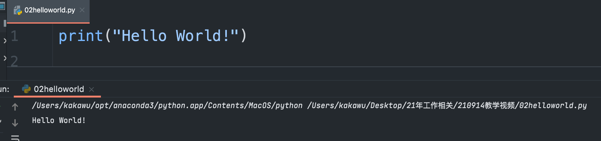

### 1.3 注意事项

#### 1.3.1 如何查看python的版本

```python
import sys
print(sys.version)
```

输出结果

```python
3.8.8 (default, Apr 13 2021, 12:59:45) 
[Clang 10.0.0 ]
```

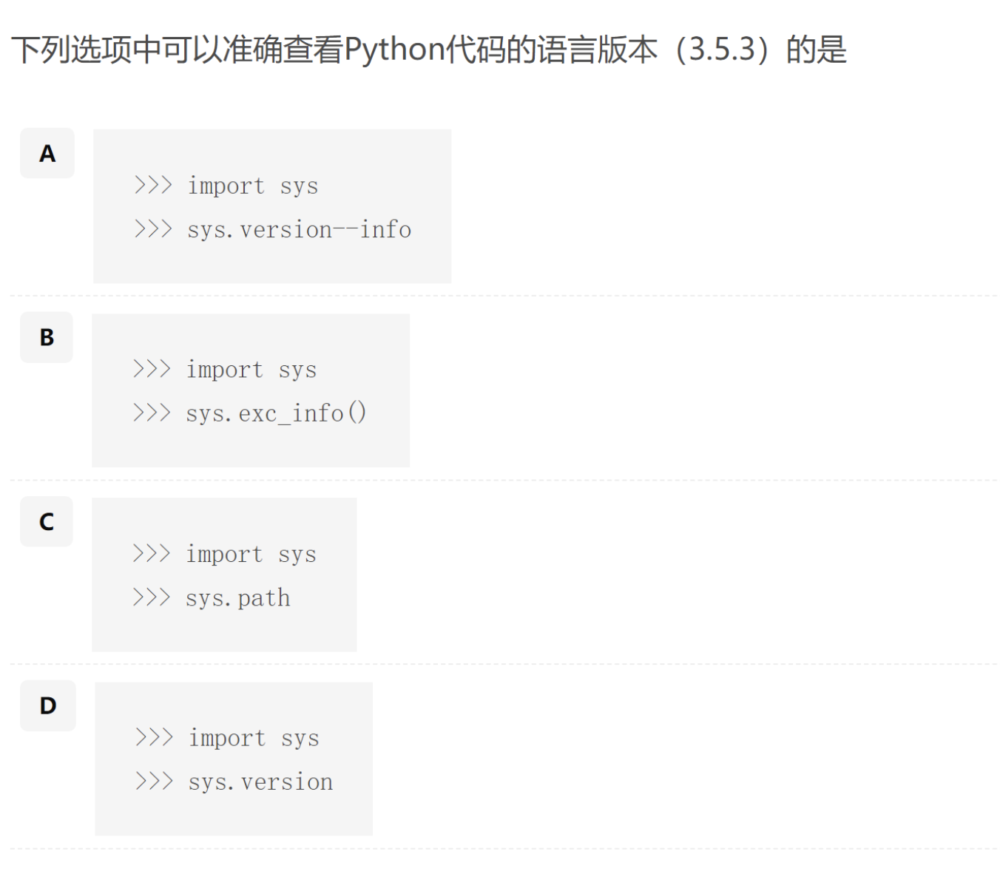


#### 1.3.2 中英文括号、引号

```python
 SyntaxError -camelCase-vivid生动
```
#### 1.3.3 缩进indent

* 4个空格
* 1个Tab

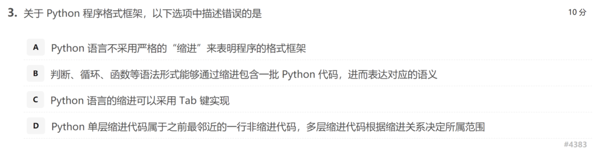

### 1.4 如何运行程序

运行 Run... -选择对应的文件名

### 1.5 注释

*  单行注释： ```#```, 快捷键```ctrl```+```/```

  ```python
  #使用print输出字符串,我是注释
  print("Hello World!")
  ```

* 多行注释：三个单引号 ```'''```开头和结尾

  ```python
  '''用print输出字符串
  我是注释
  可以多行
  '''
  print("Hello World!")
  ```

* 习题

  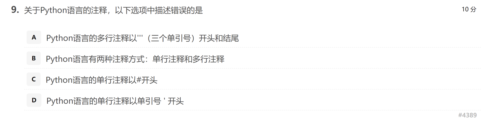

### 1.6 快捷键【多练习】

```
Ctrl+d 复制上一行代码 
ctrl+z撤销上一步操作  
ctrl+c 复制  
ctrl+v 粘贴
ctrl+x 剪切
```


### 1.7 单词【多看多理解】

type 类型
I am typing 我在打字
print 打印
printer 打印机

## 2. 数据类型和变量

### 2.1 数据类型

#### 2.1.1 四种基本的数据类型

* int integer 整型   

```python
apple=100                                                                 
```

* float 浮点 

```python
ApplePrice=2.5
```

* str string 字符串 

```python
university="北京大学"
print(university)
```


* bool  True|False
  1. 练习1

  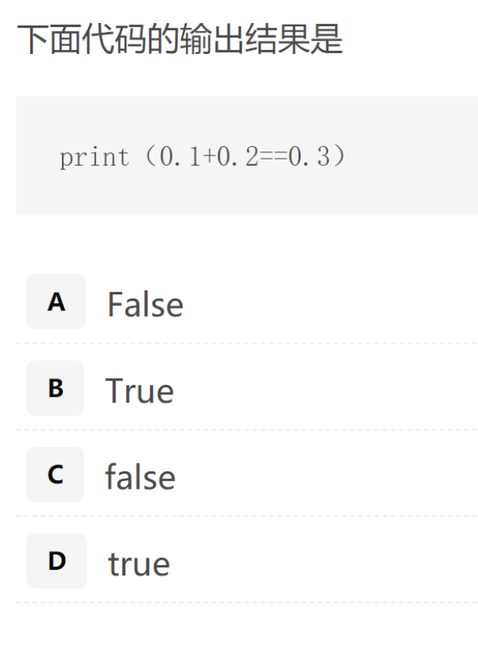

​	答案：B

 2. 练习2

    ```python
    print(round(0.1+0.2,1)==0.3)
    ```

      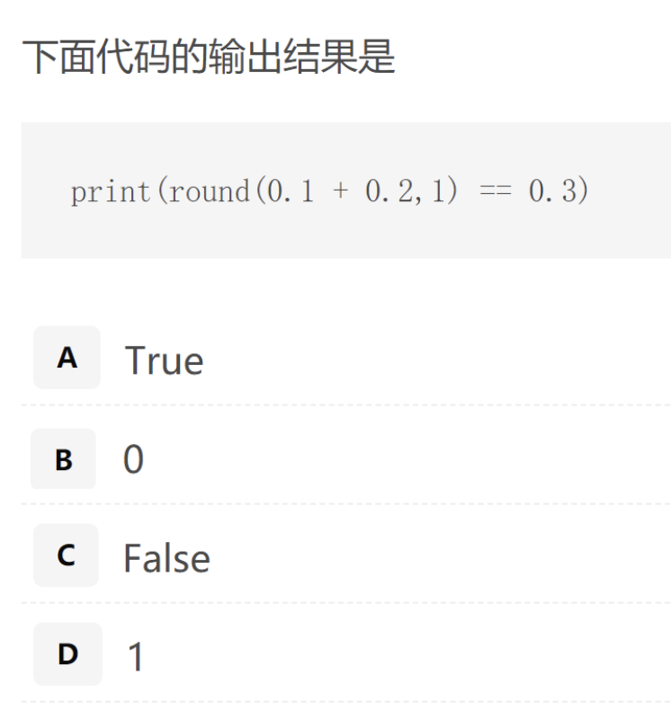
    
    

> round是什么？
>
> **round()** 方法返回浮点数x的四舍五入值。
>
> ```python
> print(round(3.1415926, 2))
> 结果：3.14
> ```

答案：True

#### 2.1.2 代码练习1：数据类型

```python
a=100
b=2.5
c="Hello World！"
d=False
print(type(a))
print(type(b))
print(type(c))
print(type(d))
```

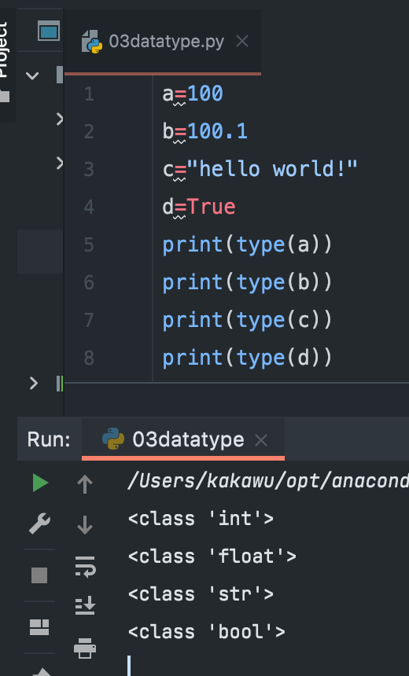

### 2.2 变量命名规则

#### 2.2.1  命名规则

1. 只能包含字母、下划线、**数字**，注意区分大小写，如：**Code4_World**；不能用**数字** 开头，如：**4_Code**
2. 不能包含空格，如：**Code World**，但可以用下划线来分隔
3. 不要跟**关键字**（有特殊含义的单词，后面会讲到）和**系统保留字**（如函数、模块等的名字）冲突。参考：[Python100天](https://github.com/jackfrued/Python-100-Days/blob/master/Day01-15/02.%E8%AF%AD%E8%A8%80%E5%85%83%E7%B4%A0.md)

* 【锦上添花】简短又具有描述性。比如：StudentName比sn要好
* 【锦上添花】慎用小写字母l和大写字母O，容易与数字1和0混用

**例题**：

* 下面选项中不符合Python语言命名规则的是：
  1. I
  2. TempStr
  3. _AI
  4. 3_1
* 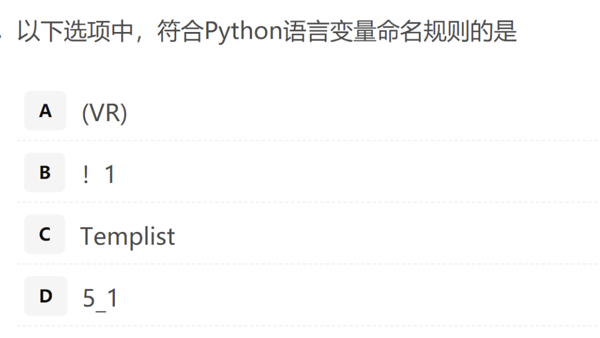

#### 2.2.2 关键字信息

查看关键字信息及<font color=red>**数量**</font>【考点】

```python
import keyword
kw=keyword.kwlist
print(kw)
print(len(kw))
```

输出结果

```python
['False', 'None', 'True', 'and', 'as', 'assert', 'async', 'await', 'break', 'class', 'continue', 'def', 'del', 'elif', 'else', 'except', 'finally', 'for', 'from', 'global', 'if', 'import', 'in', 'is', 'lambda', 'nonlocal', 'not', 'or', 'pass', 'raise', 'return', 'try', 'while', 'with', 'yield']
35
```
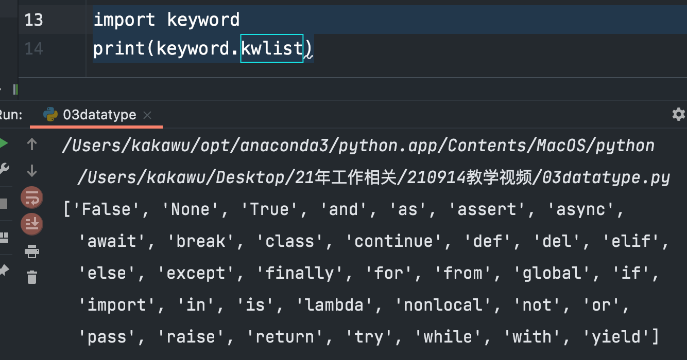

#### 2.2.3例题【NOC语法基础题】

* 下列选项中，不是Python保留字的是
  1. while
  2. do
  3. except
  4. pass

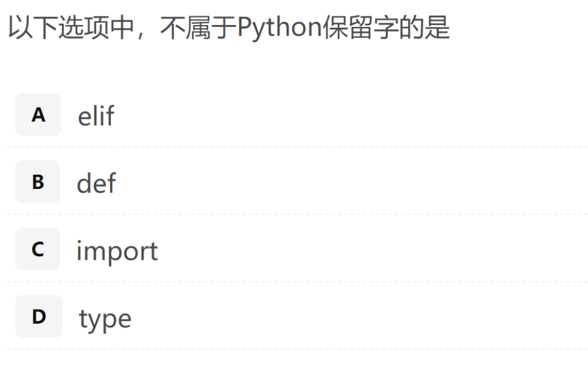


### 2.3 基本运算

#### 2.3.1 运算符号

基本的运算符号

| 运算符 | 名称             | 实例   |
| :----- | :--------------- | :----- |
| +      | 加               | x + y  |
| -      | 减               | x - y  |
| *      | 乘               | x * y  |
| /      | 除               | x / y  |
| %      | 取模             | x % y  |
| **     | 幂               | x ** y |
| //     | 地板除（取整除） | x // y |


#### 2.3.2 代码练习

1. 注意的细节

   * 乘号```* ```

     - 如何输入```*```号？ 
       - Shift+8 
       - 右侧键盘9上面的*号
     - 不是```x ```

   * 除号

     * ```python
       print(5/2)
       print(5//2)
       print(5%2)
       ```

     * 答案

     * ```python
       2.5
       2
       1
       ```

2. 注意事项

```python
a=1
b=2
a+=b   #含义是 a=a+b
print(a)
```

答案

```python
3
```


### 2.4 输出

#### 2.4.1 输出一段长的文字

```python
name="xihuan"
number=10
print("Name is %s, Num is %d"%(name,number))
# s:string
# d:decimal 十进制
# binary digit 二进制 
# bike 、bicycle 
```

输出结果

```python
Name is xihuan, Num is 10
```

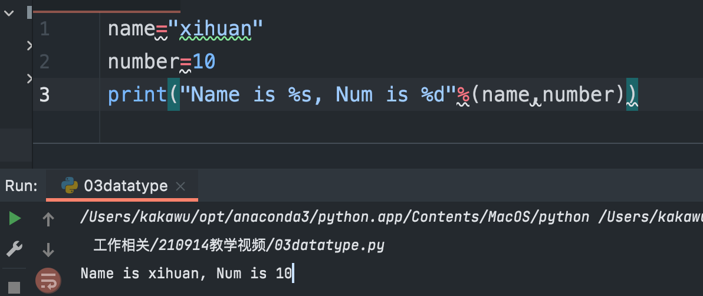

#### 2.4.2 一行输出多条Python语句

输入：

```python
print("hello");print("world")
```

输出：

```python
hello
world
```

总结：用的符号是分号<font color=red>**;**</font>

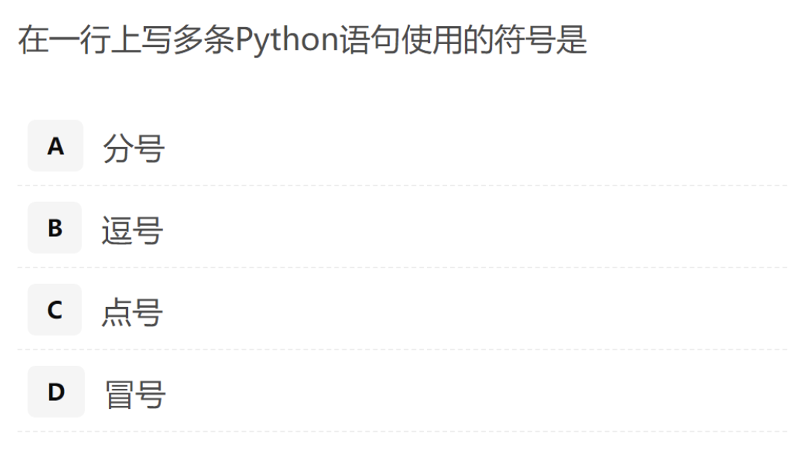

## 3. 小结

参见目录

