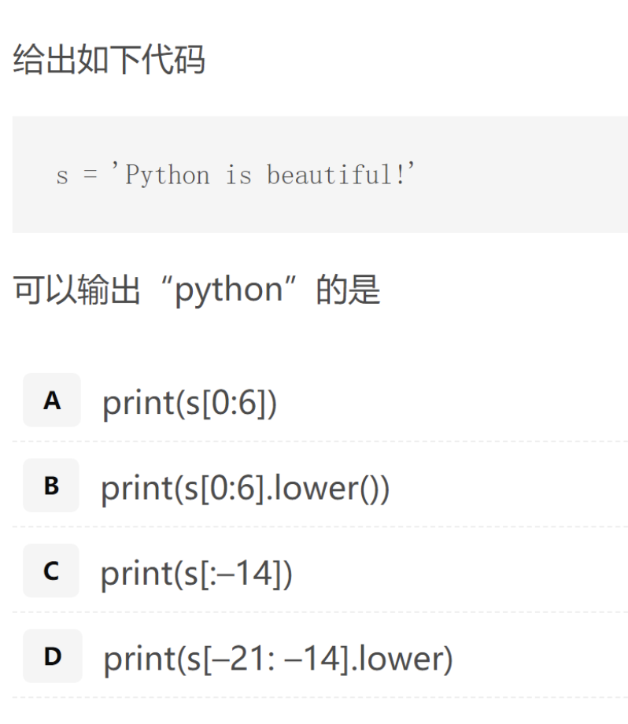
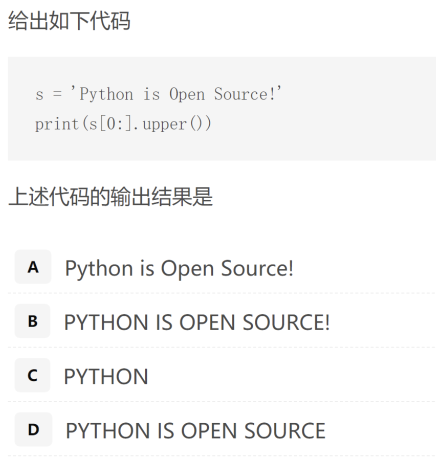

# 第二课_Python高级数据类型

BY 吴铭英 20210925

[toc]


# 高级数据类型

## 3.1 列表

### 3.1.1 是什么

* 由一系列按**特定顺序排列**的元素组成。你可以创建包含字母表中所有字母、数字0~9或所有家庭成员姓名的列表；也可以将任何东西加入列表中，其中的元素之间可以没有 任何关系。鉴于列表通常包含多个元素，给列表指定一个表示复数的名称（如letters 、digits 或names ）是个不错的主意。 在Python中，用**方括号（[] ）**来表示列表，并用逗号来分隔其中的元素。[引自Python编程实践]

### 3.1.2 怎么用

下面是一个简单的列表示例，这个列表包含几所大学：例如：

```python
universities=['北京大学','清华大学','中国人民大学']
print(universities)
```

* 输出：

```python
['北京大学', '清华大学', '中国人民大学']
```

### 3.1.3 特点

* 索引从 0而不是 1开始

  ```python
  print(universities[0])
  输出：北京大学
  ```

* **思考**：

  ```python
  print(universities[0][1]) #结果是什么
  ```

* 再思考

  ```python
  print(universities[-1])
  输出结果：中国人民大学
  ```

### 3.1.4 列表的切片

1. 列表的切片是左闭右开，即包含左边的元素不包含右边的元素。上面的例子默认的步长为1，通用的切片格式如下:

```python
[start:end:step]
即
[开始:结束:步长]
```

2. 具体例子1

```python
courses=['chinese','math','english','history','pe']
print(courses[1:4])
```

1到4之间，左闭右开区间，包含123，对应如下元素：

```python
['math','english','history']
```

3.具体例子2

```python
courses=['chinese','math','english','history','pe']
print(courses[1:4:2])
```

数学的编号是1，体育是4，步长为2，即1到4的左闭右开区间内，包括了123，步长为2，所以只有1和3，输出1、3对应的元素，输出结果

```python
['math', 'history']
```

🤔思考一下：

```python
print(universities[-3:-1])
输出结果：['北京大学', '清华大学']

print(universities[1:2])
输出结果：['清华大学']
```


* 字符串呢，请看如下例题1：



*  例题2	



### 3.1.5 随堂练习

```python 
已知 Students = ['xp','jh','gq','xh']

如何获取以下元素？
1. ['jh']
2. ['jh','gq']
3. ['xh']
```


## 3.2 元组(tuple)

## 3.2.1是什么

* 元组和列表（list）的不同之处在于：
  - 列表的元素是可以更改的，包括修改元素值，删除和插入元素，所以列表是可变序列；
  - 而元组一旦被创建，它的元素就不可更改了，所以元组是不可变序列。
* 特点：**小括号**生成，不可改变。

## 3.2.2怎么用

例子：经典的Python交换赋值语句

```python
a=1
b=2
a,b=b,a #这里发生了元组的拆包
```

 

如何构建一个单元素元组或空元组，操作有点特殊：

```python
a=(1,)           #括号有1，算完还是1
print(a)
print(type(a))

输出：
1
<class 'int'>
——————————————————————————————————————————
a=(1,)           #有逗号，生成有单元素1的元组
print(a)
print(type(a)) 


(1,)
<class 'tuple'>
```


## 3.3 集合(set)

* 用得少

* 数学意义：无序、互不重复的元素构成
  * 核心函数：``set.add``和```set.remove```


## 3.4 字典

自学