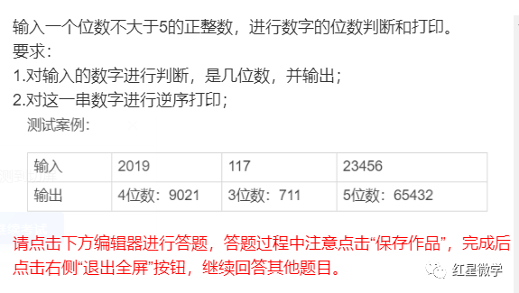

# 参考资料

1. NOC复赛模拟题 https://cloud.tencent.com/developer/news/723167

   

2. **NOC编程猫创新编程热身活动第三轮试题（中学组）**https://top.codemao.cn/news/177?name=notice

输入一个位数不大于5的正整数，进行数字的位数判断和打印。

要求：

1.对输入的数字进行判断，是几位数，并输出；

2.对这一串数字进行逆序打印；

测试案例：

