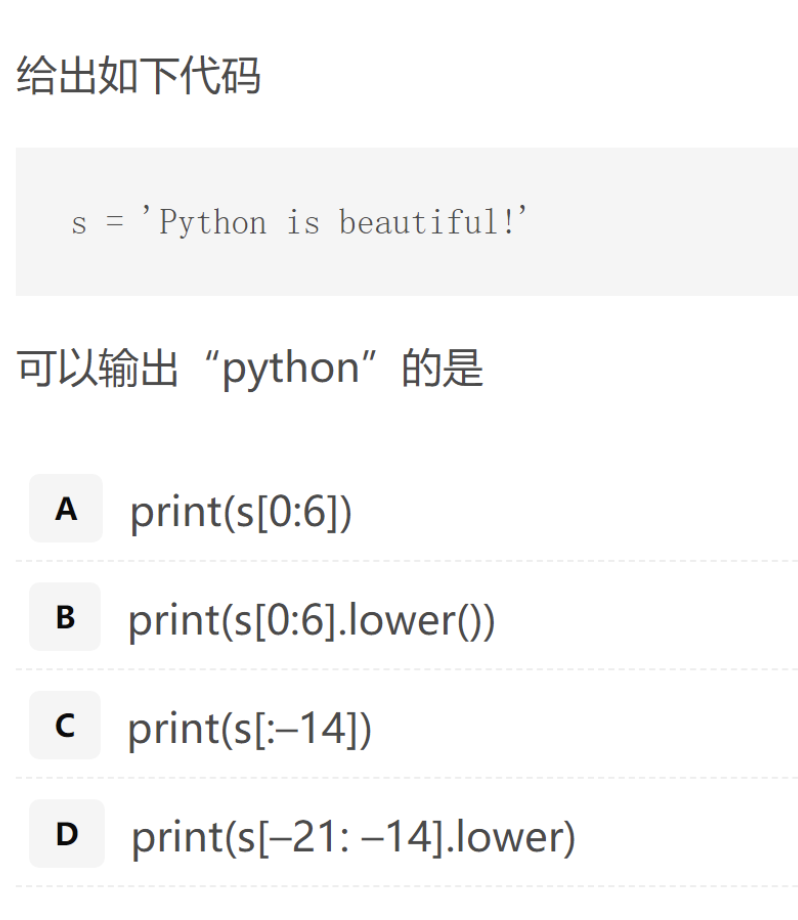
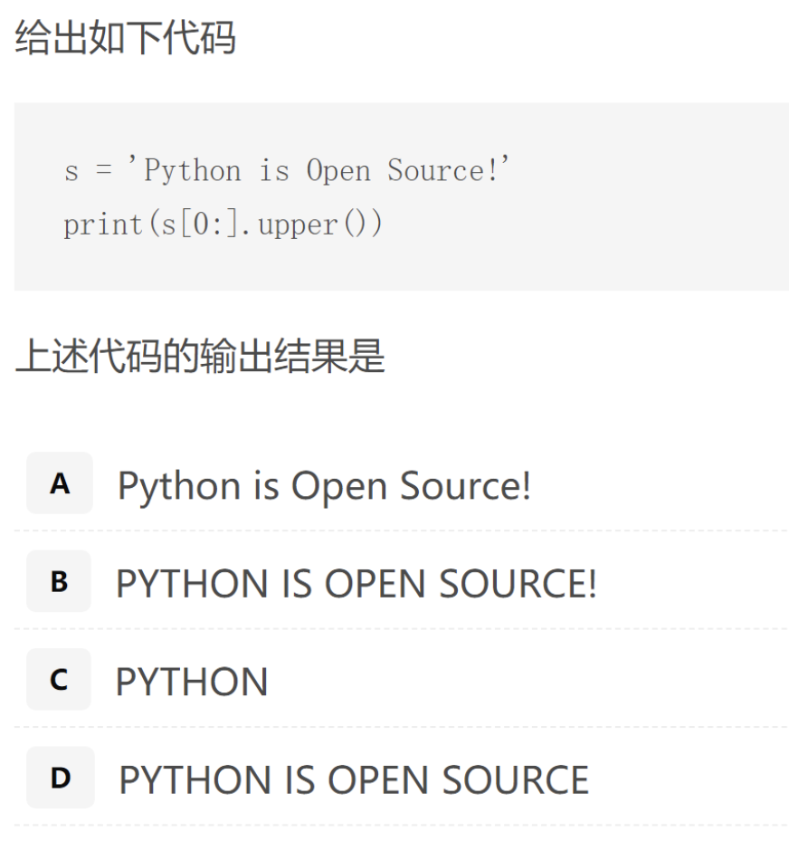

# 第二课_Python高级数据类型

BY 吴铭英 20210925

# 高级数据类型

### 3.1 列表

#### 3.1.1 是什么

* 由一系列按**特定顺序排列**的元素组成。你可以创建包含字母表中所有字母、数字0~9或所有家庭成员姓名的列表；也可以将任何东西加入列表中，其中的元素之间可以没有 任何关系。鉴于列表通常包含多个元素，给列表指定一个表示复数的名称（如letters 、digits 或names ）是个不错的主意。 在Python中，用方括号（[] ）来表示列表，并用逗号来分隔其中的元素。[引自Python编程实践]

#### 3.1.2 怎么用

下面是一个简单的列表示例，这个列表包含几所大学：例如：

```python
universities=['北京大学','清华大学','中国人民大学']
print(universities)
```

* 输出：

```python
['北京大学', '清华大学', '中国人民大学']
```

#### 3.1.3 特点

* 索引从 0而不是 1开始

  ```python
  print(universities[0])
  输出：北京大学
  ```

* **思考**：

  ```python
  print(universities[0][1]) #结果是什么
  ```

* 再思考

  ```python
  print(universities[-1])
  输出结果：中国人民大学
  ```

#### 3.1.4 列表的切片

1. 列表的切片是左闭右开，即包含左边的元素不包含右边的元素。上面的例子默认的步长为1，通用的切片格式如下:

```python
[start:end:step]
即
[开始:结束:步长]
```

2. 具体例子

```python
courses=['chinese','math','english','history','pe']
print(courses[1:4:2])
```

数学的编号是1，体育是4，步长为2，即1到4的左闭右开区间内，包括了123，步长为2，所以只有1和3，输出1、3对应的元素，输出结果

```python
['math', 'history']
```

🤔思考一下：

```python
print(universities[-3:-1])
输出结果：['北京大学', '清华大学']

print(universities[1:2])
输出结果：['清华大学']
```

* 字符串呢，请看如下例题1：



*  例题2	



### 3.2 元组

### 3.3 字典

### 3.4 集合

### 